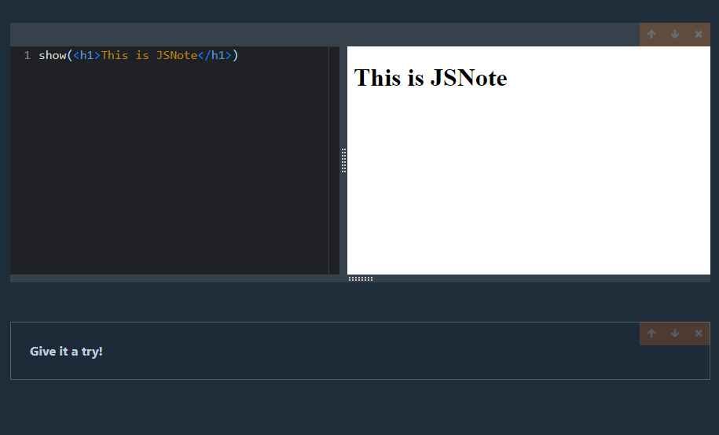

# JSNote

A cli-launchable markdown editor with executable code fields comparable to Jupyter notebooks.

The editor can be launched by running

npx jsnote-barb serve [filename] [--port=]

The filename points to the file in which all cells of the notebook are saved automatically. This .js file is portable and can be opened in other instances of JSNote. The default filename is notebook.js. The port denotes the port on which JSNote will be launched. The default port is 4005.

Inside of code cells you can call the show function. This function works similar to console.log(). It can also be used to output jsx inside of the preview window. You can import any package you like in the code cells.

